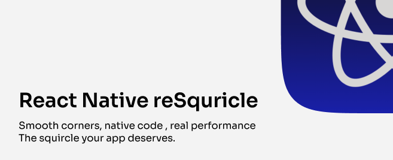
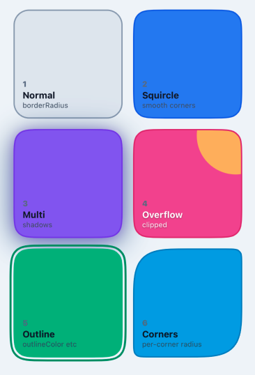

# react-native-resquircle

[](https://github.com/wS9w/react-native-resquircle/actions/workflows/ci.yml)



Native **squircle** (superellipse) components for React Native — the same smooth corners you see in iOS app icons.

## What is a squircle?

A squircle sits between a square and a circle. Unlike `borderRadius`, it uses a superellipse formula (`|x|^n + |y|^n = r^n`) so corners look smoother and more natural. This library draws it natively on iOS and Android via Fabric.

## ✨ Features

- 🚀 **Native** — C++/Kotlin/ObjC, no JS-only hacks
- ⚡ **Fabric** — New Architecture ready (RN 0.80+)
- 🎨 **API like View** — `borderRadius`, `borderWidth`, `backgroundColor`, `boxShadow`, `overflow`
- 🌓 **Android shadows** — Use `shadowColor`, `shadowOffset`, `shadowRadius`, `shadowOpacity` or `boxShadow` instead of just `elevation`
- 🧩 **RTL** — Supports `borderTopStartRadius` etc.
- 🎛️ **Outlines** — `outlineColor`, `outlineWidth`, `outlineOffset`, `outlineStyle`



## 📦 Installation

```sh
npm install react-native-resquircle
# or
yarn add react-native-resquircle
```

### Setup

| Platform | Command |
|----------|---------|
| iOS | `cd ios && pod install` |
| Expo | `expo prebuild` |
| Android | — |

## 📋 Requirements

- React Native **0.80+**
- iOS 15.1+ / Android API 24+

## 🚀 Quick start

```tsx
import { SquircleView, SquircleButton } from 'react-native-resquircle';

// Simple card
<SquircleView style={{ borderRadius: 24, backgroundColor: 'white', padding: 16 }}>
  <Text>Card content</Text>
</SquircleView>

// Button with press feedback
<SquircleButton
  style={{ borderRadius: 20, backgroundColor: '#3B82F6', padding: 16 }}
  activeOpacity={0.85}
>
  <Text style={{ color: 'white' }}>Tap me</Text>
</SquircleButton>
```

## 📖 API

### `SquircleView`

Container that clips/renders content in a squircle shape. Accepts standard `View` props and styles.

| Prop | Type | Default | Description |
|------|------|---------|-------------|
| `cornerSmoothing` | `number` | `0.6` | Smoothing factor 0–1. `0` = rectangle, `1` = maximum curve |
| `overflow` | `'visible' \| 'hidden'` | `'visible'` | Clip children to squircle boundary |
| `style` | `ViewStyle` | — | All usual styles: `borderRadius`, `borderWidth`, `backgroundColor`, `boxShadow`, etc. |

### `SquircleButton`

Pressable squircle. Wraps `SquircleView` with `Pressable`. Children can be a function: `({ pressed }) => ...`

| Prop | Type | Default | Description |
|------|------|---------|-------------|
| `cornerSmoothing` | `number` | `0.6` | Same as SquircleView |
| `overflow` | `'visible' \| 'hidden'` | `'visible'` | Same as SquircleView |
| `activeOpacity` | `number` | `0.85` | Opacity when pressed |
| `style` | `ViewStyle` | — | Applied to inner SquircleView |
| ...PressableProps | — | — | `onPress`, `onLongPress`, etc. |

### `buildBoxShadow`

Helper to build a `boxShadow` CSS-like string from shadow specs. Use with `style={{ boxShadow: buildBoxShadow([...]) }}`.

```ts
buildBoxShadow(shadows: Array<{
  x: number;
  y: number;
  blur: number;
  spread?: number;
  color: string;   // #RGB | #RRGGBB | #RRGGBBAA | rgb() | rgba()
  opacity: number; // 0–100
}>): string
```

```tsx
import { buildBoxShadow, SquircleView } from 'react-native-resquircle';

const shadow = buildBoxShadow([
  { x: 0, y: 4, blur: 12, spread: 0, color: '#000', opacity: 25 },
]);

<SquircleView style={{ borderRadius: 16, boxShadow: shadow, backgroundColor: 'white' }}>
  ...
</SquircleView>
```

> **Android:** With `SquircleView` / `SquircleButton` you can use rich shadows via `shadowColor`, `shadowOffset`, `shadowRadius`, `shadowOpacity` or `boxShadow` — not limited to `elevation` like standard RN views.

## 💡 Examples

**Corner smoothing** — `0` = sharp, `1` = most rounded:

```tsx
<SquircleView cornerSmoothing={0}   style={box} />  {/* rectangle */}
<SquircleView cornerSmoothing={0.5} style={box} />  {/* moderate */}
<SquircleView cornerSmoothing={1}   style={box} />  {/* iOS-style squircle */}
```

**Border + shadow**

```tsx
<SquircleView
  style={{
    borderRadius: 24,
    borderWidth: 2,
    borderColor: '#e5e7eb',
    boxShadow: '0 4px 12px 0 rgba(0,0,0,0.15)',
    backgroundColor: 'white',
  }}
/>
```

**Overflow hidden** — clip content to squircle:

```tsx
<SquircleView overflow="hidden" cornerSmoothing={1} style={cardStyle}>
  <Image source={...} style={{ width: 200, height: 200 }} />
</SquircleView>
```

## 🤝 Contributing

- [Development workflow](CONTRIBUTING.md#development-workflow)
- [Sending a pull request](CONTRIBUTING.md#sending-a-pull-request)
- [Code of conduct](CODE_OF_CONDUCT.md)

## 📄 License

MIT

---

Made with ✊ using [create-react-native-library](https://github.com/callstack/react-native-builder-bob)
